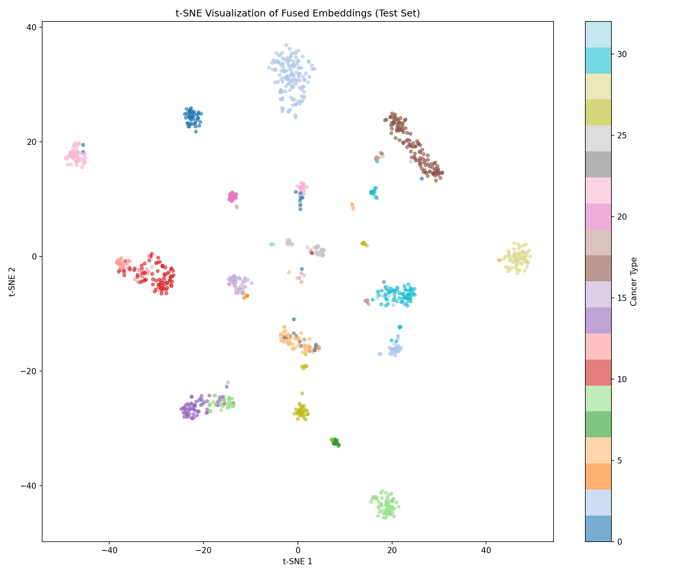
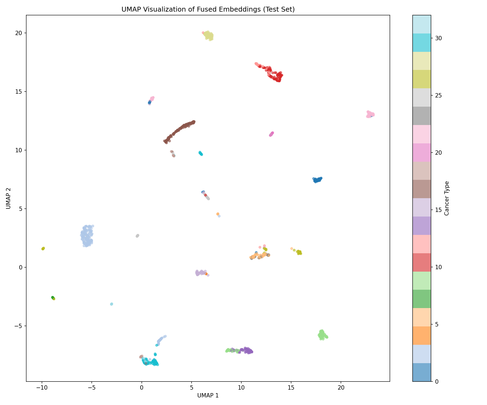
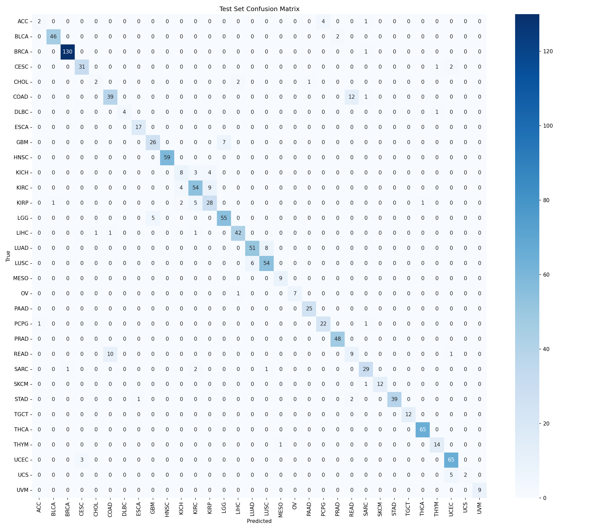

# TCGA Multi-modal Cancer Classification

[](https://www.python.org/downloads/)
[](https://opensource.org/licenses/MIT)
[](https://wandb.ai/linaomar1016-university-of-amsterdam/tcga-multimodal)

A reproducible MLOps pipeline for multi-modal cancer classification using TCGA TITAN visual embeddings and clinical text reports processed through vLLM.

## 🎯 Project Overview

This project classifies **32 cancer types** from The Cancer Genome Atlas (TCGA) dataset using:
- **Visual modality**: Pre-extracted TITAN embeddings (768-dim) from Whole Slide Images
- **Text modality**: Clinical reports cleaned with Qwen3-4B and embedded with Qwen3-Embedding-0.6B (1024-dim)

## 📊 Results

| Model | Test Macro-F1 | Test Micro-F1 | Accuracy |
|-------|---------------|---------------|----------|
| Visual Only (TITAN) | 0.57 | 0.69 | 69% |
| Text Only (Qwen3) | 0.84 | 0.88 | 88% |
| **Multi-modal (Late Fusion)** | **0.85** | **0.90** | **90%** |

📈 [View all experiments on W&B](https://wandb.ai/linaomar1016-university-of-amsterdam/tcga-multimodal)

## 📁 Repository Structure
```
tcga-multimodal-mlops/
├── configs/
│   └── config.yaml              # Centralized configuration
├── data/
│   ├── processed/               # Text embeddings
│   └── splits/                  # Patient-aware splits
├── outputs/
│   ├── models/                  # Trained models (best_model.pt)
│   ├── logs/                    # Training logs
│   └── figures/                 # Visualizations
├── scripts/
│   ├── train.py                 # Training script
│   ├── inference.py             # Inference script
│   └── visualize_embeddings.py  # UMAP/t-SNE visualization
├── src/
│   ├── data/                    # Data loading and preprocessing
│   ├── models/                  # Model architectures
│   ├── training/                # Training pipeline
│   └── utils/                   # Config, visualization utilities
├── slurm_jobs/                  # SLURM job scripts for Snellius
├── tcga_data/                   # Raw TCGA data
└── vllm/                        # vLLM scripts for text processing
```

## 🚀 Quick Start

### Installation
```bash
git clone https://github.com/Linaomaruni/tcga-multimodal-mlops.git
cd tcga-multimodal-mlops
pip install -r requirements.txt
```

### Training
```bash
# Train multimodal model with W&B logging
python scripts/train.py --model_type multimodal --wandb_project tcga-multimodal

# Train with custom hyperparameters
python scripts/train.py --lr 0.0005 --dropout 0.4 --hidden_dim 512
```

### Inference
```bash
python scripts/inference.py --model_path outputs/models/best_model.pt
```

## 🔬 Methodology

### Data Pipeline
1. **Data Inspection**: 7,544 patients with complete data across 32 cancer types
2. **Patient-Aware Splitting**: 70/15/15 train/val/test split with no patient overlap
3. **Text Cleaning**: vLLM decoder (Qwen3-4B-AWQ) cleans raw pathology reports
4. **Text Embedding**: vLLM encoder (Qwen3-Embedding-0.6B) generates 1024-dim embeddings

### Model Architecture
Late-fusion MLP combining:
- Visual branch: 768 → 512 (TITAN embeddings)
- Text branch: 1024 → 512 (Qwen3 embeddings)
- Fusion: Concatenate → 512 → 256 → 32 classes

### Hyperparameter Optimization
5 configurations tested with W&B tracking:
- Learning rates: [0.001, 0.0005]
- Dropout: [0.3, 0.4]
- Hidden dimensions: [256, 512]

## 📈 Visualizations

### Latent Space Analysis



### Confusion Matrix


## 🖥️ Snellius HPC

### vLLM Text Processing
```bash
cd vllm/src
sbatch slurm_jobs/tcga_decoder.job  # Clean reports 
sbatch slurm_jobs/tcga_encoder.job  # Generate embeddings 
```

### Training
```bash
sbatch slurm_jobs/train.job
```

## 👥 Authors

- Lina Omar 15862984
- Sarah Schaefers 15519503
- Fien van Engelen  14655179
- Jette Walvis 15834468
- Carmen van der Lans 15715353

## 📄 License

MIT License